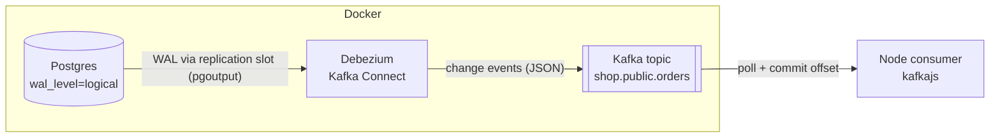

# CDC example: Postgres → Kafka → Node

Change Data Capture (CDC) MVP. Every INSERT/UPDATE/DELETE on a Postgres table is read from the WAL, streamed to Kafka by Debezium, and consumed by a Node app.

## Architecture



## Prerequisites

- Docker
- Node.js

## Run

1. Start the stack:
   ```
   make up
   ```
2. Create the table:
   ```
   docker compose exec -T cdc_pg psql -U postgres -d shop < migrations/create-orders-table.sql
   ```
3. Register the Debezium connector:
   ```
   curl -X POST -H "Content-Type: application/json" --data @pg-connector.json localhost:8083/connectors
   curl localhost:8083/connectors/shop-connector/status
   ```
4. Start the consumer:
   ```
   cd consumer && npm i && node index.js
   ```
5. Change data in `orders` with psql and watch the consumer log each change.

## How it works

- **WAL:** Postgres logs every change. `wal_level=logical` makes it keep row-level detail.
- **Replication slot:** a bookmark in the WAL. Postgres keeps WAL until Debezium has read it.
- **Debezium:** reads the slot with `pgoutput` and writes one event per change to `shop.public.orders`.
- **Event shape:** `payload.op` is `c`/`u`/`d`/`r`, with `before`, `after` and `source` (LSN, table, timestamp).
- **Kafka offset:** a message's position in the partition. The consumer group (`orders-group`) saves its offset, so a restart resumes where it stopped.
- **Ack = commit offset:** with `autoCommit: false`, an offset is committed only after processing succeeds. Uncommitted messages are replayed.
- **Delivery:** at-least-once, so handlers should be idempotent.

## Useful commands

```
make kafka-consume
docker compose exec cdc_kafka /opt/kafka/bin/kafka-consumer-groups.sh --bootstrap-server localhost:9092 --describe --group orders-group
```
